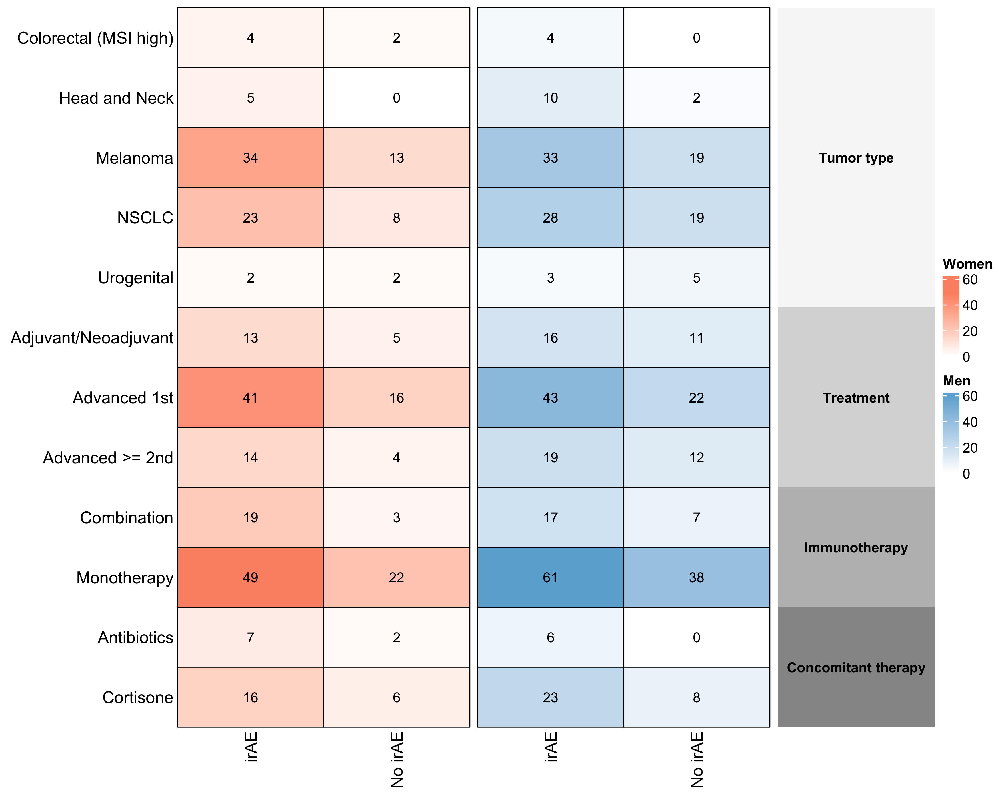

# G-Definer: Sex differences in the gut microbiome and immune-related toxicity - results from the G-Definer trial

## Overview
This repository contains an end-to-end workflow for training and evaluating scikit-learn classification models using MetaPhlAn species relative abundances (microbiome profiles) joined with clinical metadata.

The notebooks implement multiple modeling baselines:
- **Logistic regression** (`logreg_sex.ipynb`): scaled LR to predict **sex** from species abundances; also includes sex-stratified **toxicity** prediction with cross-validated metrics and ROC plots.
- **Random forest** (`rf_sex.ipynb`): scaled RF to predict **sex** and sex-stratified **toxicity** prediction; includes permutation-baseline AUROC analysis, SHAP feature importance, and exports a serialized model bundle to `models/rf_sex.joblib`.
- **SVM** (`svm_sex.ipynb`): scaled RBF-kernel SVM to predict **sex** and sex-stratified **toxicity** prediction; includes permutation-baseline AUROC analysis and exports a serialized model bundle to `models/svm_sex.joblib`.

Trained model bundles are stored in `models/` (e.g. `rf_sex.joblib`, `svm_sex.joblib`, `logreg_sex.joblib`) together with the `feature_cols` used at training time.

## Clinical information

